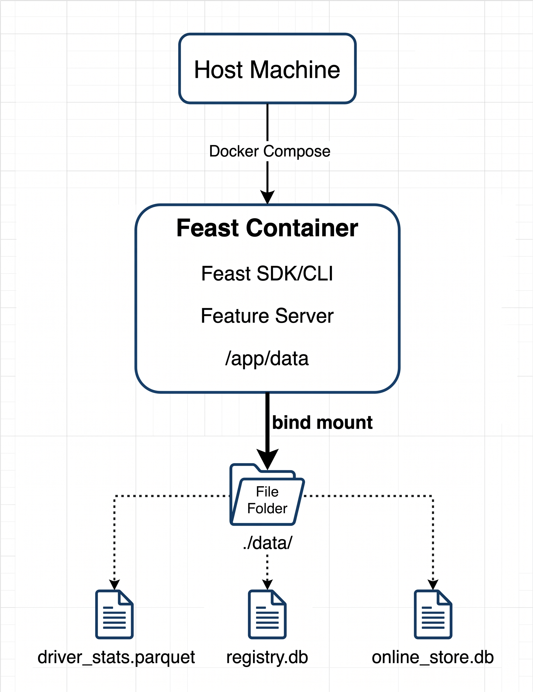

## Introduction

This lab teaches you how to containerize a local Feast feature store using Docker and Docker Compose. You will define features, materialize historical data into a SQLite online store, persist the feature-store state to your host machine, and expose the features through the Feast Python feature server.

The final system uses **Parquet as the offline store** and **SQLite as the online store**, so no Redis installation is required. Feast's current documentation uses this same local SQLite configuration for development repositories. ([Feast Documentation][1])

## Learning Objectives

By the end of this lab, you will be able to:

1. Explain the role of Docker in packaging a Feast environment.
2. Create a Docker image containing Feast and its dependencies.
3. Configure Feast with Parquet as an offline store and SQLite as an online store.
4. Define entities, data sources, and feature views.
5. Register feature definitions using `feast apply`.
6. Materialize historical features into a SQLite online store.
7. Retrieve online features using the Feast Python SDK.
8. Run the Feast Python feature server inside Docker.
9. Persist Feast registry and online-store data using Docker bind mounts.
10. Diagnose common container, configuration, and feature-materialization failures.

**Prerequisites:** Basic Python, basic Feast concepts, and basic Docker commands.

---

# Prologue: The Challenge

You are joining an ML platform team that needs a reproducible local Feature Store environment.

The team currently has several problems:

* Engineers install Feast differently.
* Python dependencies differ between machines.
* Feature definitions are difficult to reproduce.
* Online feature data disappears when development environments are recreated.
* The team needs an HTTP endpoint for applications to retrieve online features.

Your task is to package the Feature Store into a Docker environment.

The final architecture will contain:




**Architecture purpose:** The container provides the Feast runtime while the host-mounted `data/` directory preserves the feature-store state across container recreation.

---

# Environment Setup

Verify Docker:

```bash
docker --version
docker compose version
```

You should see Docker and Docker Compose version information.

You do **not** need to install Feast, Python, Redis, or SQLite on the host. These dependencies will be provided by the container.

---

# Chapter 1: Establishing the Project

Containerized applications need a predictable directory structure.

## 1.1 Create the Project

Run:

```bash
mkdir feast-docker-lab
cd feast-docker-lab

mkdir -p data
```

Create the following structure:

```text
feast-docker-lab/
├── compose.yaml
├── Dockerfile
├── .dockerignore
├── feature_store.yaml
├── features.py
├── generate_data.py
├── test_workflow.py
└── data/
```


---

# Chapter 2: Defining the Feature Store

## Opening Context

Docker packages the environment, but Feast still needs feature definitions. You will first define an entity, a Parquet data source, and a feature view.

## 2.1 Create the Feature Definitions

Create `features.py`:

```python
from datetime import timedelta

from feast import Entity, FeatureView, Field, FileSource
from feast.types import Float64, Int64, String


driver = Entity(
    name="driver",
    join_keys=["driver_id"],
    description="Driver identifier",
)

driver_stats_source = FileSource(
    name="driver_stats_source",
    path="data/driver_stats.parquet",
    timestamp_field="event_timestamp",
)

driver_stats_fv = FeatureView(
    name="driver_hourly_stats",
    entities=[driver],
    ttl=timedelta(hours=2),
    schema=[
        Field(name="conv_rate", dtype=Float64),
        Field(name="acc_rate", dtype=Float64),
        Field(name="avg_daily_trips", dtype=Int64),
        Field(name="country", dtype=String),
    ],
    source=driver_stats_source,
    online=True,
)
```

The feature view groups four features:

| Feature           | Type    | Meaning                |
| ----------------- | ------- | ---------------------- |
| `conv_rate`       | Float64 | Driver conversion rate |
| `acc_rate`        | Float64 | Driver acceptance rate |
| `avg_daily_trips` | Int64   | Average daily trips    |
| `country`         | String  | Driver country         |


---

# Chapter 3: Configuring SQLite

## 3.1 Create `feature_store.yaml`

Create:

```yaml
project: feast_docker_demo

registry: data/registry.db

provider: local

online_store:
  type: sqlite
  path: data/online_store.db

offline_store:
  type: file

entity_key_serialization_version: 3
```

This configuration creates:

```text
                 Feast
                   |
          +--------+--------+
          |                 |
     Offline Store      Online Store
          |                 |
       Parquet             SQLite
          |                 |
   driver_stats.parquet  online_store.db
```


The registry is stored separately:

```text
data/registry.db
```

Feast's current configuration documentation shows SQLite configured with:

```yaml
online_store:
  type: sqlite
  path: data/online_store.db
```

and the current quickstart uses the same local SQLite pattern. 


---

# Chapter 4: Creating the Dataset

## Opening Context

Feast needs historical data before it can materialize features into the online store.

Instead of requiring a dataset download, you will generate a deterministic local dataset.

## 4.1 Create `generate_data.py`

```python
from datetime import datetime, timedelta, timezone

import pandas as pd


drivers = [1001, 1002, 1003, 1004, 1005]
countries = ["US", "BD", "IN", "UK", "CA"]

now = datetime.now(timezone.utc)

rows = []

for i in range(100):
    rows.append(
        {
            "driver_id": drivers[i % len(drivers)],
            "event_timestamp": now - timedelta(hours=i),
            "created": now - timedelta(hours=i),
            "conv_rate": round(0.70 + (i % 10) * 0.01, 3),
            "acc_rate": round(0.50 + (i % 7) * 0.02, 3),
            "avg_daily_trips": 50 + (i % 25),
            "country": countries[i % len(countries)],
        }
    )


df = pd.DataFrame(rows)

df.to_parquet(
    "data/driver_stats.parquet",
    index=False,
)

print(f"Created {len(df)} rows")
print(df.head())
```

Notice that the timestamp is timezone-aware. Feast's point-in-time feature retrieval depends on event timestamps.

---

# Chapter 5: Building the Docker Image

## Opening Context

The Docker image should contain the runtime dependencies required by Feast. The feature data itself should remain outside the image so it can persist independently.

## 5.1 Create `Dockerfile`

```dockerfile
FROM python:3.10-slim

ENV PYTHONDONTWRITEBYTECODE=1 \
    PYTHONUNBUFFERED=1 \
    FEAST_USAGE=False

WORKDIR /app

RUN pip install --no-cache-dir \
    feast \
    pandas \
    pyarrow

COPY . /app

CMD ["tail", "-f", "/dev/null"]
```

### Why use `tail -f /dev/null`?

The container needs to remain alive while you execute individual Feast commands.

This allows you to practice:

```bash
docker compose exec feast ...
```

instead of hiding every operation inside the container's startup command.

### Think First

Why is `driver_stats.parquet` not permanently baked into the image?

<details>
<summary>Answer</summary>

The lab intentionally separates application/runtime dependencies from mutable feature data.

The `data/` directory is mounted from the host, allowing the Parquet file, registry, and SQLite database to persist independently from the container lifecycle.

</details>

---

# Chapter 6: Creating the Docker Compose Environment

## 6.1 Create `compose.yaml`

Create:

```yaml
services:
  feast:
    build:
      context: .

    container_name: feast-server

    working_dir: /app

    environment:
      FEAST_USAGE: "False"
      PYTHONPATH: /app

    volumes:
      - ./data:/app/data
      - ./feature_store.yaml:/app/feature_store.yaml
      - ./features.py:/app/features.py
      - ./generate_data.py:/app/generate_data.py
      - ./test_workflow.py:/app/test_workflow.py

    ports:
      - "6566:6566"

    command:
      - tail
      - -f
      - /dev/null
```

There is deliberately **no Redis service**.

The architecture is now:

```text
Host
│
├── data/
│   ├── driver_stats.parquet
│   ├── registry.db
│   └── online_store.db
│
└── Docker Compose
       │
       └── Feast Container
              │
              ├── Feast CLI
              ├── Feast SDK
              ├── SQLite
              └── Python Feature Server
                       │
                       └── :6566
```

---

# Chapter 7: Building and Starting the Container

## 7.1 Build the Image

Run:

```bash
docker compose build
```


---

## 7.2 Start the Container

Run:

```bash
docker compose up -d
```

Check the container:

```bash
docker compose ps
```

Expected state:

```text
NAME           STATUS
feast-server   Up
```

Verify the Feast installation:

```bash
docker compose exec feast feast version
```

---

# Chapter 8: Generating Data Inside Docker

## 8.1 Generate the Dataset

Run:

```bash
docker compose exec feast python generate_data.py
```

Expected output should indicate that 100 rows were created.

Verify the host directory:

```bash
ls -lh data/
```

You should see:

```text
driver_stats.parquet
```

### Checkpoint

You have now:

* Created a Feast project.
* Defined an entity and feature view.
* Configured SQLite as the online store.
* Generated Parquet data.
* Built a Docker image.
* Started the Feast container.
* Persisted data through a host bind mount.

---

# Chapter 9: Registering the Feature Definitions

## Opening Context

Feast separates feature definitions from the actual feature values. `feast apply` reads your Python definitions and registers the entities and feature views.

## 9.1 Apply the Configuration

Run:

```bash
docker compose exec feast feast apply
```

The exact output can vary by Feast version, but it should report that the entity and feature view were created or updated.

Verify:

```bash
docker compose exec feast feast entities list
```

Then:

```bash
docker compose exec feast feast feature-views list
```

The current Feast CLI provides commands such as `feast entities list` and `feast feature-views list`. ([Feast Documentation][2])

---

# Chapter 10: Materializing Features

## Opening Context

The Parquet file is the historical/offline source. The model-serving path needs the latest feature values in the online store.

Materialization moves eligible historical feature values into SQLite.


</details>

## 10.2 Materialize the Features

Run:

```bash
docker compose exec feast sh -c \
  'feast materialize-incremental "$(date -u +"%Y-%m-%dT%H:%M:%S")"'
```

Feast's quickstart documents `materialize-incremental` for loading feature values into the SQLite online store. ([Feast Documentation][3])

After materialization, inspect:

```bash
ls -lh data/
```

You should now have files similar to:

```text
data/
├── driver_stats.parquet
├── online_store.db
└── registry.db
```

---

# Chapter 11: Retrieving Online Features with Python

## Opening Context

The online store exists to provide the latest feature values quickly during inference.

Use the Feast Python SDK to retrieve those values.

## 11.1 Create `test_workflow.py`

```python
from pprint import pprint

from feast import FeatureStore


store = FeatureStore(repo_path=".")

feature_vector = store.get_online_features(
    features=[
        "driver_hourly_stats:conv_rate",
        "driver_hourly_stats:acc_rate",
        "driver_hourly_stats:avg_daily_trips",
        "driver_hourly_stats:country",
    ],
    entity_rows=[
        {"driver_id": 1001},
        {"driver_id": 1002},
    ],
).to_dict()

pprint(feature_vector)
```

The current Feast Python API supports `get_online_features()` with feature references and entity rows, returning an online response that can be converted to a dictionary. ([Feast API Documentation][4])

## 11.2 Run the Test

```bash
docker compose exec feast python test_workflow.py
```

You should receive values similar to:

```python
{
    "driver_id": [1001, 1002],
    "conv_rate": [0.71, 0.72],
    "acc_rate": [..., ...],
    "avg_daily_trips": [..., ...],
    "country": ["US", "BD"],
}
```

The exact values depend on the generated timestamps and materialization window.

---

# Chapter 12: Running the Feast Feature Server

## Opening Context

The Python SDK works well when your application is written in Python.

A model-serving application written in another language needs an HTTP interface. Feast provides a Python feature server that exposes feature retrieval through HTTP JSON APIs. The current documentation uses `feast serve`, with port `6566` by default. ([Feast Documentation][5])

## 12.1 Start the Server

Run:

```bash
docker compose exec feast \
  feast serve \
  --host 0.0.0.0 \
  --port 6566
```

Keep this terminal running.

In another terminal:

```bash
curl http://localhost:6566
```

The exact root response can vary by Feast version. The important verification is that the server is reachable.

---

# Chapter 13: Test Feature Serving

Use the feature server's HTTP API rather than assuming a specific response layout.

For example, inspect the available API behavior through the running service and Feast documentation.

The Python feature server is specifically designed to provide HTTP/JSON access to online features from applications written in other languages. ([Feast Documentation][5])

You can also verify the same underlying feature values with the Python SDK:

```bash
docker compose exec feast python test_workflow.py
```

### Think First

What is the difference between these two operations?

```text
get_online_features()
```

and

```text
feast serve
```

<details>
<summary>Answer</summary>

`get_online_features()` is a Python SDK operation performed directly against the configured online store.

`feast serve` exposes Feast through an HTTP service so external applications can request features without directly importing the Feast SDK.

</details>

---

# Chapter 14: Persistence Experiment

This experiment verifies why the Docker volume configuration matters.

## 14.1 Record the Current State

Run:

```bash
ls -lh data/
```

You should have:

```text
driver_stats.parquet
online_store.db
registry.db
```

## 14.2 Remove the Container

Run:

```bash
docker compose down
```

Check:

```bash
ls -lh data/
```


## 14.3 Recreate the Container

Run:

```bash
docker compose up -d
```

Verify:

```bash
docker compose exec feast feast entities list
```

Then:

```bash
docker compose exec feast python test_workflow.py
```

The feature-store state should still be available.

---

# Chapter 15: Deliberate Failure Experiment

A production-oriented lab should demonstrate failure rather than only successful execution.

## Experiment: Break the Online Store Path

Stop the container:

```bash
docker compose down
```

Edit `feature_store.yaml`:

```yaml
online_store:
  type: sqlite
  path: data/broken.db
```

Start the container:

```bash
docker compose up -d
```

Run:

```bash
docker compose exec feast feast apply
```

Then inspect:

```bash
ls -lh data/
```

### What happened?

The configuration now points Feast to a different SQLite database.

This demonstrates that **configuration determines where online feature state is stored**.

Restore:

```yaml
online_store:
  type: sqlite
  path: data/online_store.db
```

Then run:

```bash
docker compose exec feast feast apply
```

---

# Chapter 16: Inspecting the Container

Docker is not only about starting applications. You should be able to inspect the runtime.

Run:

```bash
docker compose exec feast pwd
```

Expected:

```text
/app
```

Inspect the data:

```bash
docker compose exec feast ls -lh /app/data
```

Inspect the Python environment:

```bash
docker compose exec feast python --version
```

Inspect Feast:

```bash
docker compose exec feast feast version
```

Inspect the running processes:

```bash
docker compose exec feast ps
```

### Checkpoint

You can now:

* Inspect the container filesystem.
* Verify Python and Feast versions.
* Inspect mounted data.
* Run Feast commands inside the container.
* Explain the difference between container state and host-mounted state.

---

# Epilogue: The Complete System

You have built the following system:


## Endpoint / Operation Summary

| Operation                       | Purpose                                      |
| ------------------------------- | -------------------------------------------- |
| `feast apply`                   | Register feature definitions                 |
| `feast materialize-incremental` | Load historical features into online storage |
| `get_online_features()`         | Retrieve online features through Python      |
| `feast serve`                   | Expose online feature retrieval through HTTP |
| `docker compose up`             | Start the container                          |
| `docker compose down`           | Stop and remove the container                |
| `docker compose exec`           | Execute commands inside the container        |

---

# The Principles

1. **Containerize the runtime, not mutable state.**
   The Docker image contains Feast and its dependencies. The host-mounted directory contains persistent feature data.

2. **Separate offline and online responsibilities.**
   Parquet provides historical data. SQLite provides the latest materialized values for online retrieval.

3. **Use service boundaries deliberately.**
   The Feast SDK provides direct Python access. The feature server provides an HTTP boundary for external applications.

4. **Make infrastructure reproducible.**
   Dockerfile and Compose configuration ensure the environment can be recreated consistently.

5. **Persist important state explicitly.**
   Containers are replaceable. Bind-mounted data should contain state that must survive container recreation.

6. **Verify both configuration and runtime.**
   `feast apply`, materialization, SDK retrieval, container inspection, and feature-server access verify different parts of the system.

7. **Keep local architecture appropriate to the learning objective.**
   SQLite removes Redis from this introductory Docker lab. Redis can be introduced later as a distributed online-store architecture.

---

# Final Verification

Run the following sequence:

```bash
docker compose build

docker compose up -d

docker compose exec feast feast version

docker compose exec feast python generate_data.py

docker compose exec feast feast apply

docker compose exec feast feast entities list

docker compose exec feast feast feature-views list

docker compose exec feast sh -c \
  'feast materialize-incremental "$(date -u +"%Y-%m-%dT%H:%M:%S")"'

docker compose exec feast python test_workflow.py

ls -lh data/
```

Then start the feature server:

```bash
docker compose exec feast \
  feast serve \
  --host 0.0.0.0 \
  --port 6566
```


---


